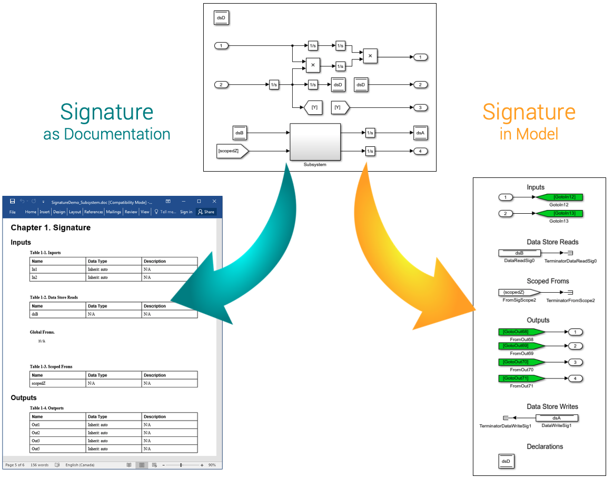

# Signature Tool

The notion of subsystem is used in Simulink to represent systems inside systems in order to provide hierarchical modeling. A Simulink subsystem has inports (explicit links to the subsystem), and outports (explicit links from the subsystem). We view inports and outports as the explicit interface of the subsystem. However, there are hidden (implicit) data dependencies in Simulink’s subsystems. Hidden dependencies originate due to two Simulink data mechanisms:

1. Data Store Memory/Read/Write
1. Goto/From blocks

The Signature Tool extracts the signature of a Simulink subsystem. A signature represents the interface of a Simulink subsystem, making the data flow into and out of the subsystem explicit. The tool identifies two useful signatures for a subsystem: strong signature and weak signature. The strong signature identifies the data mechanisms that are accessed by the subsystem or any of its children. The weak signature identifies the data mechanisms that a subsystem can access (those which are declared higher up in the hierarchy), but is not necessarily using. The Signature Tool can be used to either explicitly include the signatures in the model itself, or export the signatures into a text/tex/docx file.

## User Guide
For installation and other information, please see the [User Guide](doc/Signature_UserGuide.pdf).

## Related Publications
Marc Bender, Karen Laurin, Mark Lawford, Vera Pantelic, Alexandre Korobkine, Jeff Ong, Bennett Mackenzie, Monika Bialy, Steven Postma, [“Signature required: Making Simulink data flow and interfaces explicit,”](https://www.sciencedirect.com/science/article/pii/S0167642315001392) *Science of Computer Programming*, Elsevier, 2015, 113, Part 1, 29-50.

Vera Pantelic, Steven Postma, Mark Lawford, Alexandre Korobkine, Bennett Mackenzie, Jeff Ong, Marc Bender, ["A Toolset for Simulink: Improving Software Engineering Practices in Development with Simulink,"](https://ieeexplore.ieee.org/document/7323083/) In *Proceedings of 3rd International Conference on Model-Driven Engineering and Software Development (MODELSWARD 2015)*, SCITEPRESS, 2015, 50-61. DOI: https://doi.org/10.5220/0005236100500061 [(Best Paper Award)](http://www.modelsward.org/PreviousAwards.aspx)

Vera Pantelic, Steven Postma, Mark Lawford, Monika Jaskolka, Bennett Mackenzie, Alexandre Korobkine, Marc Bender, Jeff Ong, Gordon Marks, Alan Wassyng, [“Software engineering practices and Simulink: bridging the gap,”](https://link.springer.com/article/10.1007/s10009-017-0450-9) *International Journal on Software Tools for Technology Transfer (STTT)*, 2017, 95–117. DOI: https://doi.org/10.1007/s10009-017-0450-9 

## Matlab Central

:star: *This tool was selected by MathWorks as ["Pick of the Week"](https://blogs.mathworks.com/pick/2017/07/14/what-are-the-functional-inputs-and-outputs-of-my-simulink-model/)!*

It is also available on the [Matlab Central File Exchange](https://www.mathworks.com/matlabcentral/fileexchange/49897-signature-tool). 

